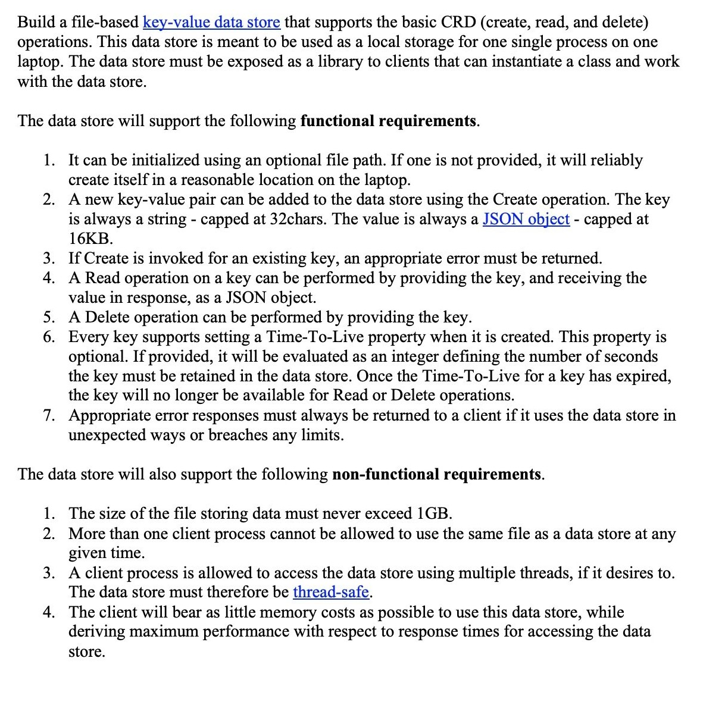
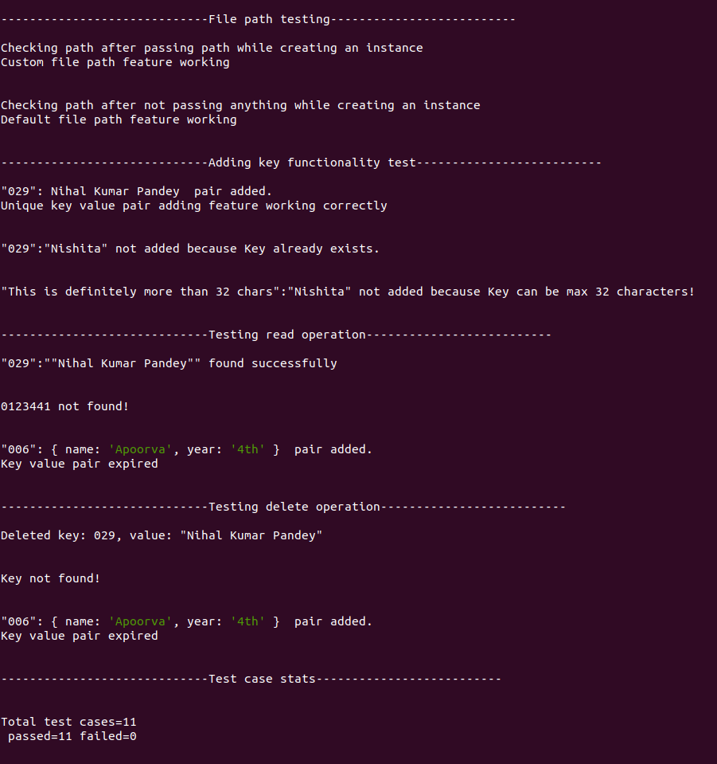

# **DATASTORE**

## **Problem Statement:**



<hr>

## **Table of Contents** 

1. **[Getting Started](#gettingstarted)**<br>
2. **[File Structure](#filestructure)**<br>
3. **[Demonstration](#demonstration)**<br>
4. **[Test case output screenshots](#testcases)**<br>

<hr>

<a name = "gettingstarted"></a>

## **Getting Started**

To get started with this library, clone this repo and then run the npm installer to get all the system requirements and to run the program without any error.<br>
Run the following command: <br>

```Javascript
git clone git@github.com:nihalpandey4/DataStore.git
cd DataStore
npm install
```

After running this command in command shell a node_modules folder will be created which will make run the program without error and in node environment.

<hr>

<a name="filestructure"></a>

## **File Structure**

1. **datastore.js** - This file contains class DataStore which can be imported and instantiated for using this data store.
2. **test.js** - This file contains code for testing various paths of execution in datastore.js

<hr>

<a name = "demonstration"></a>

## **Demonstrating of DataStore.js**

This is a brief summary of running the file as library.

### Examples:

### 1. **Initialising instance of DataStore in test.js**

```javascript
//Importing our datastore file as library
const DataStore = require("./datastore");

//Instantiating the datastore class in our library by creating object for it.
const datastore = new DataStore();
```

### 2. **Adding Key Value Pair in local database using datastore**

```javascript
console.log(datastore.add("032","Nishkarsh Tripathi",20)) //returns true as record is created
console.log(datastore.add("032","Nihal Pandey",20)) //returns false and prints error to the console as key is already present

console.log(datastore.add("this sentence is more than 32 chars", 0, 0)); //Returns false and wont create as the key is not capped under 32 char
```

### 3. **Reading existing Key Value Pair**

```javascript
console.log(datastore.read("032")); //Valid Callback if called before time to live property 
console.log(store.read("Not Key")); //returns null as such key doesnt exist
```

### 4. **Deleting Existing key value pair**

```javascript
console.log(datastore.delete("032")); //returns true if called before time to live property
console.log(datastore.delete("Not Key")); //Invalid as such key doesnt exist
```

<hr>

<a name="testcases"></a>

## Test case screenshots

Test cases can be run by executing this command

```Javascript
npm test
```

### Output screen will look like this



<hr>